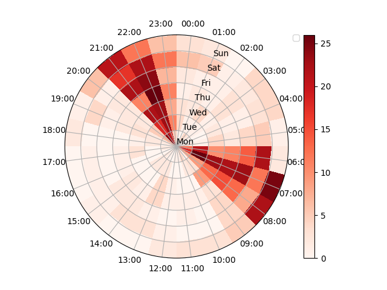

# Citizen Sleep Science
Sleep based Citizen Science Workflows, for generating and sharing interesting sleep health data.

## Workflow 1: Python Plot of Google Take Out Data

## Workflow 2: Metriport (Android app only)
Compare weight to sleep duration
Compare exercise duration against sleep duration

### sensors:
Google Nest Hub, Withings mattress, google watch, withings body + scales.

Google Nest Hub, Withings mattress.
